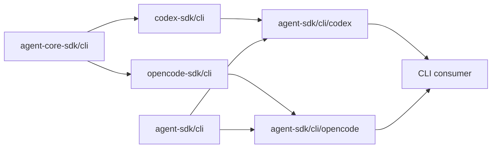
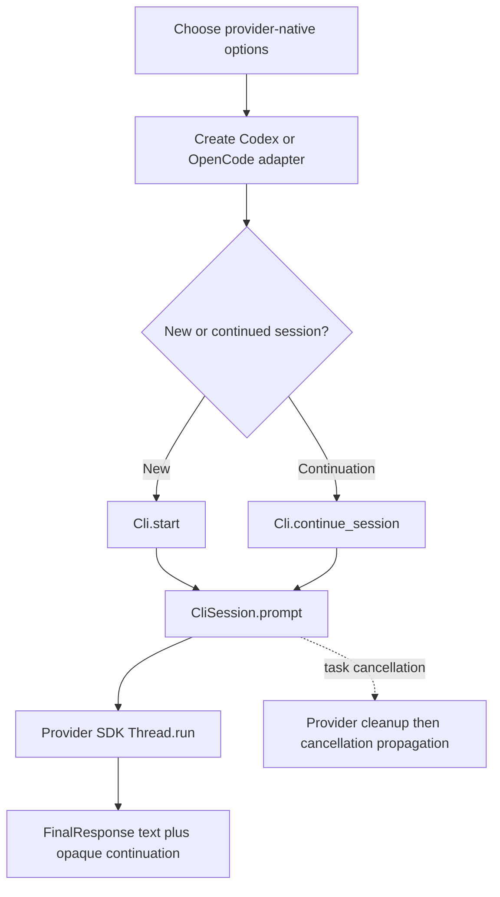

# totto2727/agent-sdk

Provider-neutral MoonBit interfaces for running Codex and OpenCode CLI sessions without merging their provider-specific configuration, event, or error models.

## Packages

| Package | Responsibility |
| --- | --- |
| `totto2727/agent-sdk/cli` | Common text/context prompt, session identifier, opaque continuation, final response, changed-file list, and cancellable session contract |
| `totto2727/agent-sdk/cli/codex` | Codex adapter configured with native `ClientOptions`, `ThreadOptions`, and `TurnOptions` |
| `totto2727/agent-sdk/cli/opencode` | OpenCode adapter configured with native `ClientOptions` and `ThreadOptions` |

`src/server/.gitkeep` only reserves a future directory. This module contains no Server package, contract, adapter, or implementation.

## Dependency direction



`agent-sdk/cli` imports neither provider nor `agent-core-sdk`. Each adapter imports only the common package and its matching provider SDK. `agent-sdk` therefore has no direct dependency on `agent-core-sdk` and no provider-to-provider dependency.

## Target support

The module, common `src/cli` package, and both provider adapter packages declare `+wasm+native` support with `wasm` as the preferred target. Native remains supported, and both targets use the same source files and package layout.

The adapters keep provider process behavior behind `codex-sdk/cli` and `opencode-sdk/cli`; `agent-sdk` does not add target-specific source directories, packages, backends, or shims. Target-unspecified validation uses Wasm, while a Wasm host must supply the process bridge required by the provider SDKs.

## Processing flow



The common `Prompt` contains provider-neutral text and an optional caller-ordered list of context files. `CliSession::id` and `FinalResponse::session_id` expose the provider thread or session identifier when available. A `Continuation` remains an opaque handle that encapsulates provider-owned resume behavior. `FinalResponse::changed_files` contains completed Codex patch paths and is empty for OpenCode because its current event model does not expose a reliable change set. Cancelling the MoonBit task that runs `CliSession::prompt` cooperatively cancels the provider call and propagates the cancellation error after provider cleanup.

Codex preserves the existing Workgraph prompt behavior by appending the supplied context path list to the prompt text. OpenCode maps the same list to ordered `Text` and `LocalFile` inputs; callers remain responsible for resolving relative paths against their workspace before constructing the common prompt.

Provider-specific sandbox, approval, permission, configuration, events, rich inputs, output metadata, and errors remain in `codex-sdk/cli` or `opencode-sdk/cli`. Adapter constructors accept provider-native option types, and provider errors pass through unchanged, so consumers may import the chosen provider SDK when they need those extensions.

## Usage

```mbt check
///|
async fn run(cli : @cli.Cli, prompt : String) -> @cli.FinalResponse {
  cli.start().prompt(@cli.Prompt::Prompt(prompt))
}
```

Choose an adapter without changing the consumer flow:

```mbt check
///|
let codex = @codex_adapter.codex_cli(
  options=@codex.ClientOptions::ClientOptions(),
  thread_options=@codex.ThreadOptions::ThreadOptions(),
  turn_options=@codex.TurnOptions::TurnOptions(),
  resume_thread_id?=None,
)

///|
let opencode = @opencode_adapter.opencode_cli(
  options=@opencode.ClientOptions::ClientOptions(),
  thread_options=@opencode.ThreadOptions::ThreadOptions(),
  resume_thread_id?=None,
)
```

Both adapter constructors retain their provider-native option types and accept an optional initial resume identifier. Existing text-only `Prompt::Prompt(text)` callers and opaque continuation flows remain valid.

## Development

The module retains the template's `source = "./src"` layout. Dependencies and target support are declared according to MoonBit's official [module configuration](https://docs.moonbitlang.com/en/latest/toolchain/moon/module.html) and [package configuration](https://docs.moonbitlang.com/en/latest/toolchain/moon/package.html).

The default Nix development shell contains only the MoonBit toolchain. The `ci` shell inherits that environment and adds Codex from [codex-cli-nix](https://github.com/sadjow/codex-cli-nix) and OpenCode from the [official OpenCode repository](https://github.com/anomalyco/opencode), so CLI process tests do not expand the default development closure.

Run the standard module checks with the preferred target:

```bash
moon update
moon info
moon check
moon test
moon build
moon package --list
```

CI loads the `ci` shell through the shared MoonBit actions on the monorepo `main` branch and runs target-unspecified checks against registry dependencies. It does not clone SDK source repositories or generate a `moon.work` overlay.
