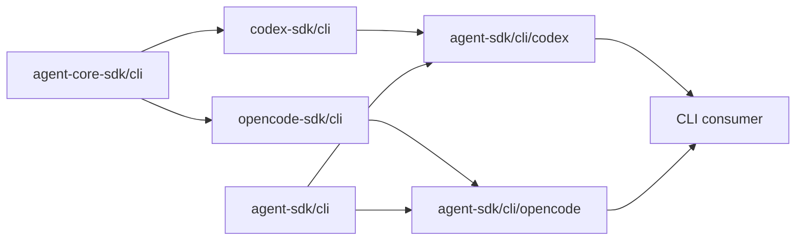
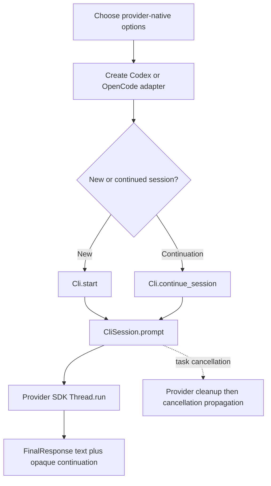

# totto2727/agent-sdk

Provider-neutral MoonBit interfaces for running Codex and OpenCode CLI sessions without merging their provider-specific configuration, event, or error models.

## Packages

| Package | Responsibility |
| --- | --- |
| `totto2727/agent-sdk/cli` | Common text prompt, opaque continuation, final response, and cancellable session contract |
| `totto2727/agent-sdk/cli/codex` | Codex adapter configured with native `CodexOptions`, `ThreadOptions`, and `TurnOptions` |
| `totto2727/agent-sdk/cli/opencode` | OpenCode adapter configured with native `OpenCodeOptions` and `ThreadOptions` |

`src/server/.gitkeep` only reserves a future directory. This module contains no Server package, contract, adapter, or implementation.

## Dependency direction



`agent-sdk/cli` imports neither provider nor `agent-core-sdk`. Each adapter imports only the common package and its matching provider SDK. `agent-sdk` therefore has no direct dependency on `agent-core-sdk` and no provider-to-provider dependency.

## Target matrix

The module, common `src/cli` package, and both provider adapter packages declare `+wasm+native` support with `native` as the preferred target. Every supported target uses the same source files and package layout.

| Surface | Native | Wasm |
| --- | --- | --- |
| `src/cli` common contract | Check, test, and build | Check, test, and build |
| `src/cli/codex` adapter | Check, test, and build | Check, test, and build |
| `src/cli/opencode` adapter | Check, test, and build | Check, test, and build |
| `src/server` | Reserved by `.gitkeep` only | Reserved by `.gitkeep` only |

The adapters keep provider process behavior behind `codex-sdk/cli` and `opencode-sdk/cli`; `agent-sdk` does not add target-specific source directories, packages, backends, or shims. Native remains preferred because the provider SDKs ultimately connect to installed CLI processes. A Wasm host must supply the process bridge required by those provider SDKs.

## Processing flow



The common `Prompt` contains text only. A `Continuation` is an opaque handle that encapsulates provider-owned resume behavior, including any provider continuation state, without exposing a raw provider identifier. Cancelling the MoonBit task that runs `CliSession::prompt` cooperatively cancels the provider call and propagates the cancellation error after provider cleanup.

Provider-specific sandbox, approval, permission, configuration, events, rich inputs, output metadata, and errors remain in `codex-sdk/cli` or `opencode-sdk/cli`. Adapter constructors accept provider-native option types, and provider errors pass through unchanged, so consumers may import the chosen provider SDK when they need those extensions.

## Usage

```mbt check
///|
async fn run(cli : @cli.Cli, prompt : String) -> @cli.FinalResponse {
  cli.start().prompt(@cli.Prompt::Prompt(prompt))
}
```

Choose an adapter without changing the consumer flow:

```mbt check
///|
let codex = @codex_adapter.codex_cli(
  options=@codex.CodexOptions::CodexOptions(),
  thread_options=@codex.ThreadOptions::ThreadOptions(),
  turn_options=@codex.TurnOptions::TurnOptions(),
)

///|
let opencode = @opencode_adapter.opencode_cli(
  options=@opencode.OpenCodeOptions::OpenCodeOptions(),
  thread_options=@opencode.ThreadOptions::ThreadOptions(),
)
```

## Development

The module retains the template's `source = "./src"` layout. Dependencies and target support are declared according to MoonBit's official [module configuration](https://docs.moonbitlang.com/en/latest/toolchain/moon/module.html) and [package configuration](https://docs.moonbitlang.com/en/latest/toolchain/moon/package.html).

Run the standard module checks for each supported target once the provider SDK versions are available in the registry:

```bash
moon update
moon info
moon check --target native
moon test --target native --jobs 1 --no-parallelize
moon build --target native
moon package --list

moon check --target wasm
moon test --target wasm --jobs 1 --no-parallelize
moon build --target wasm
moon package --list
```

Before publication, CI validates through a temporary `moon.work` overlay pinned to `agent-core-sdk` commit `127a11e9c4b0bf0067e3082a55af0a44e69c5fe0`, `codex-sdk` commit `15577d304a2b5888d4032de406176254754ccb57`, and `opencode-sdk` commit `03660eca982c7867155ff17dff0aced279a22902`. No dependency override or workspace file is committed.
